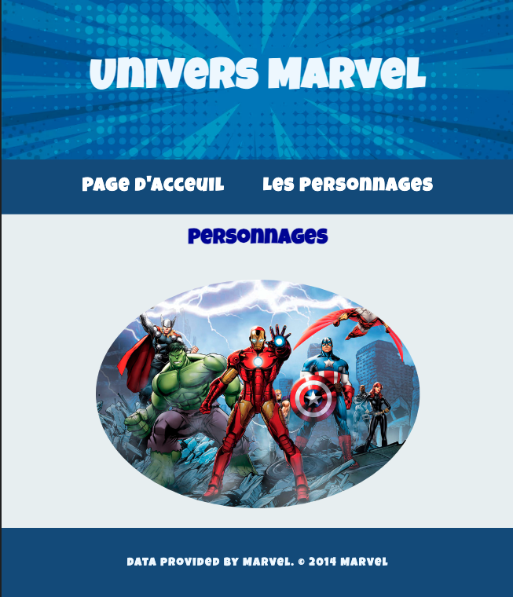

# SPA Monopage avec REST

<p float="left">
  
   
</p>


## Installation

Clone the repository:

```bash
git clone https://github.com/maryline888/rest_api_marvel
npm init
npm i express dotenv request
npm start # Pour démarrer le serveur, j'ai ajouté "start": "node server.js" dans le fichier package.json
