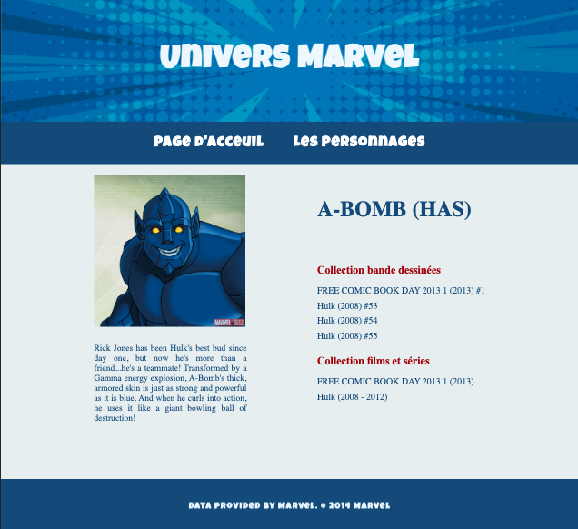

# SPA Monopage avec REST

| Page Accueil | Page description personnagess |
|---------|---------|
|  |  |

## Installation

Clone the repository:

```bash
git clone https://github.com/maryline888/rest_api_marvel
npm init
npm i express dotenv request
npm start # Pour démarrer le serveur, j'ai ajouté "start": "node server.js" dans le fichier package.json
